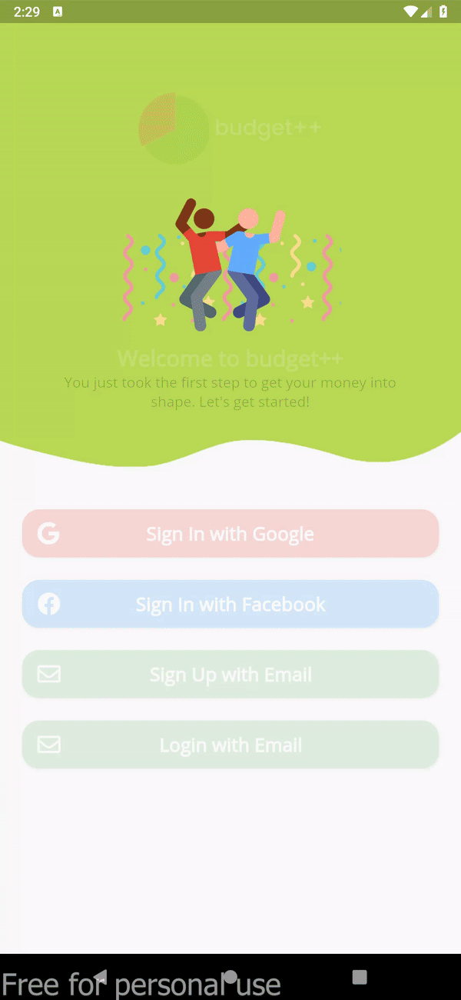

### My Flutter Animations

My collection of Flutter Animations that aims to improve the user experience of the application for your next flutter project.
Built by Dominic Antigua [Dominic Antigua](https://antiguadominic.com)

 

### About Me

I am a Computer Science student from the Philippines. This repo is just to share the source code of my animations.

 

### The Animations

<a href="https://github.com/Dark-Matterr/flutter_animation/tree/master/login_animation"><h3>Login Animation</h3></a>

Use only basic Animation Controller to move images and widgets.

<a href="https://github.com/Dark-Matterr/flutter_animation/tree/master/login_animation">View Code</a>
                

